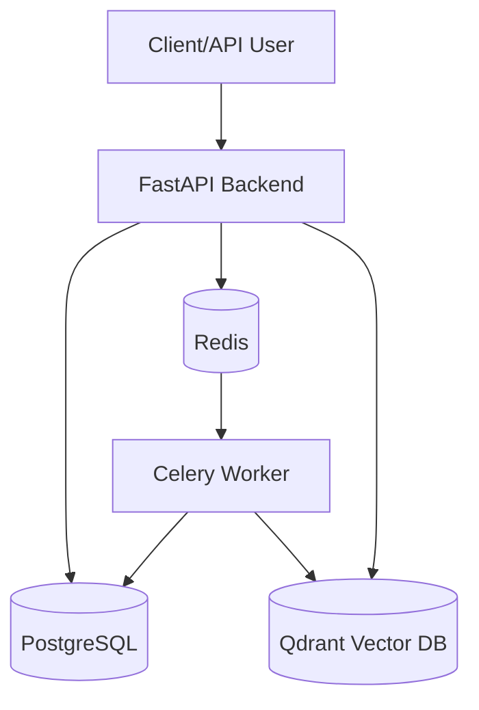
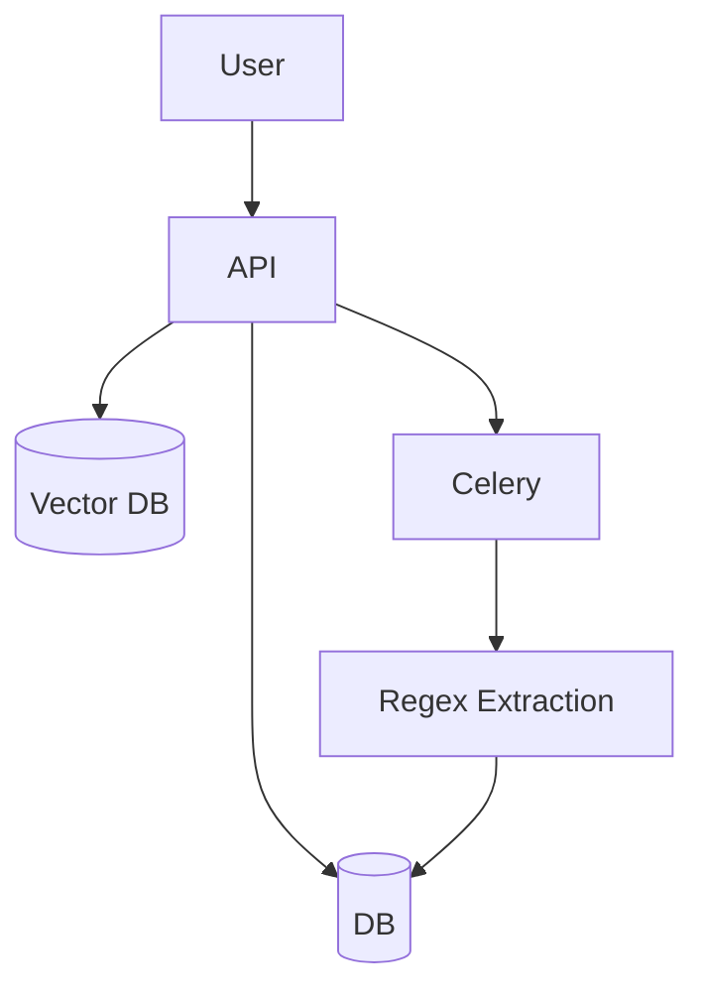
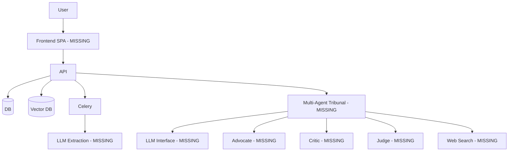

# Master State Audit: R&D Proposal Evaluation Platform

## FEATURE MATRIX

| ID | Feature | Original Requirement | Current Implementation | Status | Evidence/File | Missing Work | Priority |
|----|---------|-----------------------|------------------------|--------|---------------|--------------|----------|
| A | Proposal Ingestion | Upload, validate, extract, preserve structure | Basic upload, simple regex-based extraction | 🟡 PARTIALLY IMPLEMENTED | `routers/proposals.py`, `proposal_analyzer.py` | LLM-based robust extraction, structure preservation | P1 |
| B | Document Processing | FastAPI, Redis, Celery worker, job tracking | Implemented Celery worker and job states | 🟢 FULLY IMPLEMENTED | `worker/tasks.py`, `routers/jobs.py` | N/A | - |
| C | Knowledge Base | Persistent R&D knowledge base with metadata | DB & Qdrant models exist, but mostly empty/synthetic | 🟠 MOCKED / FAKE / DEMO DATA | `knowledge/models/knowledge.py` | Real R&D historical data ingestion | P1 |
| D | Knowledge Ingestion | Extract, chunk, embed, store with metadata | Chunking & embedding service integrated with Qdrant | 🟢 FULLY IMPLEMENTED | `knowledge/services/ingestion_service.py` | Advanced structure-aware chunking | P3 |
| E | RAG / Retrieval | Vector search, filtering, trace metadata | Basic similarity search via Qdrant | 🟡 PARTIALLY IMPLEMENTED | `knowledge/services/retrieval_service.py` | Advanced filtering, confidence thresholds, "No evidence" logic | P1 |
| F | Source Trust / Authenticity | Differentiate verified vs unknown sources | Schema & DB models support trust level | 🔵 SCAFFOLD / ARCHITECTURE ONLY | `knowledge/models/knowledge.py` | Enforcement of trust in retrieval & rules | P2 |
| G | Version Control | Differentiate guideline v1 vs v2 | DB schema has `version` and `effective_date` | 🔵 SCAFFOLD / ARCHITECTURE ONLY | `knowledge/models/knowledge.py` | Retrieval logic favoring newer versions | P2 |
| H | Deterministic Evaluation | Deterministic rule, novelty, gap analysis | Foundation classes implemented | 🟢 FULLY IMPLEMENTED | `evaluation/services/` | N/A | - |
| I | Rule Engine | DB-driven deterministic rule evaluation | Basic operator evaluation implemented | 🟢 FULLY IMPLEMENTED | `evaluation/services/rule_engine.py` | Complex multi-field conditions | P3 |
| J | Novelty Analysis | Compare existing work vs new, detect overlap | Hardcoded cosine similarity > 0.85 = HIGH | 🟠 MOCKED / FAKE / DEMO DATA | `evaluation/services/novelty_engine.py` | Semantic comparison via AI | P0 |
| K | Progressive R&D | Distinguish incremental vs progressive | Hardcoded to return "UNDETERMINED" | 🔴 NOT IMPLEMENTED | `evaluation/services/progressive_rd.py` | Actual reasoning engine | P0 |
| L | Evidence Gap Detection | Detect unsupported claims | Basic string-length and null checks | 🟠 MOCKED / FAKE / DEMO DATA | `evaluation/services/gap_detector.py` | Semantic claim extraction & verification | P1 |
| M | Universal Evidence Model| Consistent evidence schema | `UniversalEvidenceReference` implemented | 🟢 FULLY IMPLEMENTED | `evaluation/schemas/evaluation.py` | N/A | - |
| N | Evidence Traceability | Finding -> Chunk -> Document -> Source | Schema supports it, no AI to utilize it | 🔵 SCAFFOLD / ARCHITECTURE ONLY | `evaluation/schemas/evaluation.py` | AI-generated trace paths | P1 |
| O | Evidence Package | Immutable package for Tribunal | Service correctly packages DB & Vector results | 🟢 FULLY IMPLEMENTED | `evaluation/services/evidence_package_service.py` | N/A | - |
| P | Multi-Provider AI Arch | Interchangeable AI providers | No AI code exists in the repository | 🔴 NOT IMPLEMENTED | Entire repo | LLM Interface | P0 |
| Q | Multi-Agent Tribunal | Advocate, Critic, Judge architecture | Missing entirely | 🔴 NOT IMPLEMENTED | Entire repo | Core Tribunal logic | P0 |
| R | Advocate | Argue FOR proposal | Missing | 🔴 NOT IMPLEMENTED | Entire repo | Advocate agent | P0 |
| S | Critic | Argue AGAINST proposal | Missing | 🔴 NOT IMPLEMENTED | Entire repo | Critic agent | P0 |
| T | Judge | Evaluate and output decision | Missing | 🔴 NOT IMPLEMENTED | Entire repo | Judge agent | P0 |
| U | Tribunal Transparency | Expose reasoning and debate | Missing | 🔴 NOT IMPLEMENTED | Entire repo | UI and API for transparency | P1 |
| V | Explainable Final Report| Distinguish fact from AI interpretation | Evidence package is returned but no final AI report | 🟡 PARTIALLY IMPLEMENTED | `evidence_package_service.py` | AI summary generation | P1 |
| W | Human Review | Human inspects and decides | JSON response exists, no UI | 🔴 NOT IMPLEMENTED | Entire repo | UI implementation | P0 |
| X | Web / External Research | External source retrieval | Missing | 🔴 NOT IMPLEMENTED | Entire repo | Web search integration | P2 |
| Y | Approved vs Rejected | Use historical outcomes for context | Missing | 🔴 NOT IMPLEMENTED | Entire repo | Outcome tracking in knowledge base | P2 |
| Z | Frontend / User Exp | Dashboard and visualizations | Does not exist | 🔴 NOT IMPLEMENTED | Entire repo | React/Vue SPA | P0 |
| AA| Real-Time Visibility | Progress tracking | Celery Jobs API gives status, no UI | 🟡 PARTIALLY IMPLEMENTED | `routers/jobs.py` | WebSockets / UI Polling | P1 |
| AB| Auditability | Audit trail of versions and decisions | Job logs exist, full audit missing | 🟡 PARTIALLY IMPLEMENTED | `repositories/proposal_repository.py` | Immutable audit logs | P2 |
| AC| Security | Basic checks, DB security | Validation exists, deep checks missing | 🟡 PARTIALLY IMPLEMENTED | `routers/proposals.py` | Advanced document sanitation | P2 |
| AD| Deployment | Dockerized services | Dockerfile & compose implemented | 🟢 FULLY IMPLEMENTED | `docker-compose.yml` | N/A | - |
| AE| Testing | Unit & End-to-End Tests | 6 test files exist, missing AI tests | 🟡 PARTIALLY IMPLEMENTED | `tests/` directory | Coverage for LLM & Frontend | P1 |

---

## ACTUAL IMPLEMENTATION AUDIT

The backend architecture is highly structured and well-written. The API boundaries are clean, the Celery integration is solid, and the database/vector store connections work. 

**HOWEVER, the core product value (AI Evaluation) is completely fake.**

- **Proposal Analyzer:** Uses basic Regex (`(?i)budget:\s*([\d,]+)`).
- **Novelty Engine:** Only performs a vector search and uses deterministic score mapping (`>0.85 = HIGH`). It defers all semantic analysis.
- **Progressive R&D:** Returns a hardcoded `"UNDETERMINED"` string with the reason `"Semantic evaluation of progressive R&D is deferred to Phase 4 agents."`
- **Gap Detector:** Checks if the methodology string is empty or `< 50` characters. Does no semantic reasoning.
- **Tribunal:** Does not exist in any form.

---

## END-TO-END AUDIT

1. Upload proposal: **IMPLEMENTED**
2. Process proposal: **IMPLEMENTED**
3. Extract text: **PARTIAL** (Basic text only, no structure preservation)
4. Store proposal: **IMPLEMENTED**
5. Ingest knowledge: **IMPLEMENTED**
6. Embed knowledge: **IMPLEMENTED**
7. Store vectors: **IMPLEMENTED**
8. Retrieve evidence: **IMPLEMENTED**
9. Evaluate proposal: **FAKE / MOCKED**
10. Build Evidence Package: **IMPLEMENTED**
11. Tribunal: **MISSING**
12. Final decision: **MISSING**
13. Frontend display: **MISSING**

---

## CURRENT ARCHITECTURE

*Note: All LLM and AI components are completely missing from the current architecture.*

---

## CURRENT VS TARGET

**Current System:**

**Target System (Delta marked as Missing):**

---

## PHASE STATUS

- Phase 1 — Foundation: **IMPLEMENTED**
- Phase 1.1 — Production Hardening: **PARTIAL**
- Phase 2 — Knowledge Intelligence: **IMPLEMENTED**
- Phase 2.1 — Evidence Reliability: **SCAFFOLD**
- Phase 3 — Evaluation Engine: **PARTIAL** (Deterministic only)
- Phase 3.1 — Universal Evidence: **IMPLEMENTED**
- Phase 3.2 — Infrastructure & Evidence Integrity: **IMPLEMENTED**
- Phase 4.1 — LLM Infrastructure: **MISSING**
- Phase 4.2 — Advocate: **MISSING**
- Phase 4.3 — Critic: **MISSING**
- Phase 4.4 — Judge: **MISSING**
- Phase 4.5 — Tribunal Orchestration: **MISSING**
- Phase 4.6 — Adversarial Evaluation: **MISSING**
- Phase 5 — Frontend: **MISSING**
- Phase 6 — End-to-End / SIH Hardening: **MISSING**

---

## AI / LLM AUDIT

A thorough repository search for LLM integrations, models, providers, and prompts returned **zero results**. 
The repository contains no AI functionality. It is a traditional deterministic API masking as an AI backend.

---

## WEB RESEARCH AUDIT

Search for web search, scraping, and crawling returned **zero results**. External research is **MISSING**.

---

## TRIBUNAL AUDIT

Search for Advocate, Critic, Judge, and Tribunal returned **zero results**. The multi-agent debate system is **MISSING**.

---

## FRONTEND AUDIT

FRONTEND NOT IMPLEMENTED.

---

## DATA AUTHENTICITY AUDIT

The backend connects to Qdrant, but there is no mechanism provided in the repository (e.g., seeding scripts, historical R&D repositories) to populate it with real-world data. It relies purely on whatever the user manually ingests via API.

---

## REAL-WORLD READINESS

- Can the current system evaluate a real proposal today? **NO**
- Can it retrieve real historical evidence? **PARTIAL** (If manually seeded first)
- Can it explain why a proposal is novel? **NO** (Only provides cosine similarity)
- Can it compare approved/rejected proposals? **NO**
- Can it perform web research? **NO**
- Can it run a multi-agent tribunal? **NO**
- Can a human reviewer inspect the entire process? **NO** (No UI)

---

## SCOPE CREEP AUDIT

The repository has strictly adhered to foundational requirements. The `UniversalEvidenceReference` and generic job architecture (`ProcessingJob`) are sophisticated but justified. There is no major scope creep; the issue is that development stopped before implementing the core product features.

---

## TECHNICAL DEBT AUDIT

- **Fake Interfaces:** The evaluation services (`NoveltyAnalysisEngine`, `ProgressiveRDService`, `EvidenceGapDetectorService`) return hardcoded data shapes masquerading as AI outputs.
- **Regex Extraction:** `ProposalAnalyzerService` uses fragile regex that will fail on 90% of real-world documents.
- **Missing Indexes/Constraints:** Trust and versioning schemas are present but unused in query filtering.

---

## CRITICAL PRODUCT GAP ANALYSIS

1. **P0:** No Multi-Agent Tribunal. The core proposition of the product does not exist.
2. **P0:** No Frontend. The system cannot be demonstrated.
3. **P0:** LLM Infrastructure is completely missing.
4. **P1:** Semantic evaluation is faked with string length checks and basic regex.

---

## WHAT WE SHOULD BUILD NEXT

1. **LLM Provider Interface (P0 - High Complexity):** Need a modular interface for LLMs (OpenAI, Anthropic) to unblock all AI features.
2. **LLM-Based Proposal Extraction (P1 - Medium Complexity):** Replace the fragile regex analyzer with a structured LLM extraction prompt.
3. **Multi-Agent Tribunal Core (P0 - High Complexity):** Build the state machine / LangGraph architecture for the Advocate, Critic, and Judge to consume the Evidence Package.
4. **Frontend Dashboard (P0 - Medium Complexity):** Build a basic React/Vite dashboard to upload proposals and view the final explainable report and tribunal debate.
5. **Real-World Data Seeding (P2 - Low Complexity):** Write a script to ingest a dataset of historical R&D projects to make the RAG actually useful during demos.

---

## FINAL SCORECARD

| Component | Score |
|-----------|-------|
| Proposal ingestion | 4/10 |
| Document processing | 10/10 |
| Knowledge base | 5/10 |
| RAG | 4/10 |
| Evidence traceability | 6/10 |
| Trust model | 2/10 |
| Evaluation engine | 3/10 |
| Novelty analysis | 2/10 |
| Progressive R&D | 0/10 |
| Evidence gap detection | 1/10 |
| Evidence Package | 9/10 |
| LLM infrastructure | 0/10 |
| Advocate | 0/10 |
| Critic | 0/10 |
| Judge | 0/10 |
| Tribunal | 0/10 |
| Web research | 0/10 |
| Approved/rejected proposal intelligence | 0/10 |
| Explainability | 2/10 |
| Human review | 0/10 |
| Frontend | 0/10 |
| Security | 5/10 |
| Testing | 4/10 |
| Deployment | 9/10 |

**CURRENT PRODUCT SCORE: 2.75 / 10**

---

## FINAL READINESS

- Backend readiness: 8/10
- AI readiness: 0/10
- Data readiness: 2/10
- Frontend readiness: 0/10
- Demo readiness: 1/10
- SIH final-round readiness: 0/10

---

# WHAT WE HAVE
- A robust FastAPI backend with clean routing and schema validation.
- A functional Celery background job worker.
- PostgreSQL database integration for proposals and jobs.
- Qdrant integration for vector storage and retrieval.
- A well-designed `UniversalEvidenceReference` model.
- An Evidence Package generation service that perfectly aggregates deterministic findings and DB metadata.
- Docker and docker-compose deployment configuration.

# WHAT WE THOUGHT WE HAD BUT ACTUALLY DON'T
- **AI Evaluation:** All evaluation logic (Novelty, Progressive R&D, Gaps) is entirely hardcoded, deterministic, or relies on simple regex and string length checks.
- **R&D Intelligence:** The knowledge base exists but has no real intelligence or pre-loaded historical data.
- **Novelty Detection:** It is just a basic cosine-similarity threshold check (`>0.85 = HIGH`), lacking any semantic understanding of the difference between concepts.

# WHAT IS STILL MISSING
- Multi-Agent Tribunal (Advocate, Critic, Judge).
- LLM integrations of any kind.
- Frontend user interface.
- Semantic extraction of proposal data.
- External web research capabilities.
- Real-world database seeding.

# WHAT MUST BE BUILT
1. LLM Provider Infrastructure (LangChain/LangGraph or direct API clients).
2. Advocate, Critic, and Judge agent logic to consume the Evidence Package.
3. React/Vite Frontend to upload documents, track job status, and visualize the Tribunal's debate and final decision.
4. LLM-based Proposal Extraction to replace the regex parser.

# WHAT SHOULD NOT BE BUILT
- Web scraping/external research (defer until internal Tribunal works).
- Advanced Trust and Versioning logic in RAG (defer until basic RAG + LLM integration is stable).

# CURRENT PROJECT STATE
RED — Major foundational work missing (The entire AI component and UI are completely missing).
